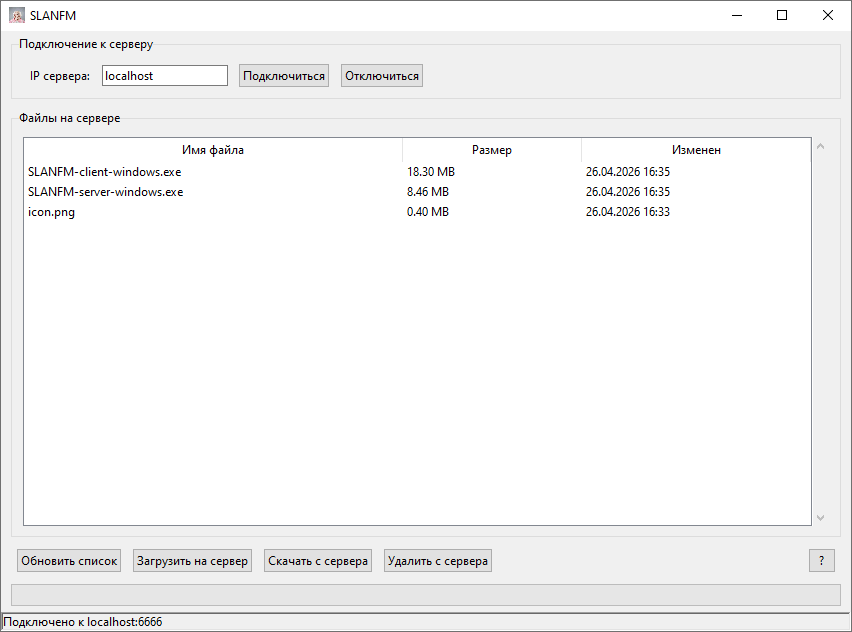
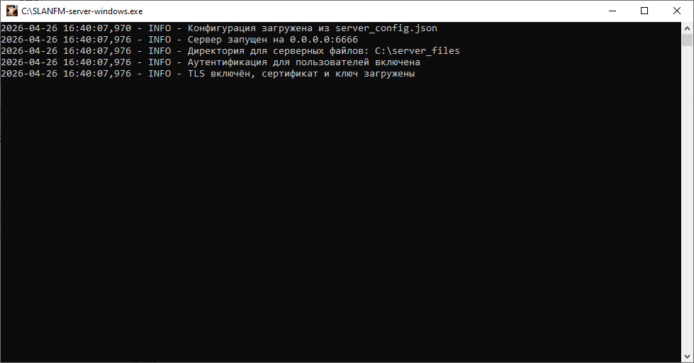

# SLANFM

**Простое клиент-серверное приложение для передачи файлов по локальной сети.**

## Установка и запуск

1. Перейдите на [страницу релизов](https://github.com/Sandile225325/SLANFM/releases) и скачайте последние версии архивов:   
   - `SLANFM-client-windows.zip` – клиент;   
   - `SLANFM-server-windows.zip` – сервер.   

2. Распакуйте каждый архив.

3. Запустите `SLANFM-server-windows.exe` для хостинга сервера.

4. Запустите `SLANFM-client-windows.exe` для использования клиента.

**ИЛИ**

1. Клонируйте репозиторий и перейдите в его корневую папку:  
    ```
    git clone https://github.com/Sandile225325/SLANFM.git
    cd SLANFM
    ```

2. Установите необходимые библиотеки:
    ```
    pip install -r requirements.txt
    ```

3. Запуск сервера:
    ```
    python server/server.py
    ```

4. Запуск клиента:
    ```
    python client/gui.py
    ```

## Настройка

### Сервер

Конфигурация сервера хранится в файле **`server/server_config.json`**.

Пример содержимого:
```
{
    "host": "0.0.0.0",
    "port": 6666,
    "upload_dir": "server_files",
    "max_file_size": 2147483648,
    "chunk_size": 65536,
    "timeout": 120,
    "can_clients_delete_files": true,
    "auth_token": "",
    "tls_enabled": true,
    "cert_file": "certificate.crt",
    "key_file": "private_key.key"
}
```

`host` — IP-адрес для прослушивания (`0.0.0.0` — все интерфейсы);   
`port` — порт;  
`upload_dir` — папка для хранения файлов (может быть относительной или абсолютной);   
`max_file_size` — максимальный размер загружаемого файла в байтах;  
`chunk_size` — размер блока данных при передаче в байтах;   
`timeout` — таймаут сокета в секундах;  
`can_clients_delete_files` — разрешать ли клиентам удаление файлов;   
`auth_token` — токен для аутентификации клиентов;   
`tls_enabled` — использовать ли шифрование TLS;  
`cert_file` — путь к файлу сертификата, необходим для работы TLS;  
`key_file` — путь к файлу приватного ключа, необходим для работы TLS.

**Если значение `auth_token` пустое, аутентификация не требуется.**

**Если значение `tls_enabled` = `false`, параметры `cert_file` и `key_file` игнорируются.**

### Клиент

Конфигурация клиента хранится в файле **`client/config.json`**.

Пример содержимого:
```
{
  "connect_config": {
    "PORT": "6666"
  },
  "values_config": {
    "chunk_size_range": [
      1024,
      10485760
    ],
    "timeout_range": [
      1,
      300
    ]
  },
  "input_save_config": {
    "host": ""
  },
  "authentication_config": {
    "token": ""
  }
}
```

`connect_config.PORT` — порт, используемый при подключении;    
`values_config.chunk_size_range` — допустимый диапазон размера чанка в байтах;   
`values_config.timeout_range` — допустимый диапазон таймаута в секундах;     
`input_save_config.host` — последний введённый IP-адрес;  
`authentication.token` — токен, используемый для аутентификации при подключении.

**Если сервер предлагает параметры, выходящие за эти диапазоны, клиент откажется подключаться.**

**Значение токена можно оставить пустым для ручного ввода при подключении.**

### Генерация самоподписанного сертификата для TLS

Для включения шифрования можно сгенерировать собственный сертификат с помощью OpenSSL:

```
openssl req -x509 -newkey rsa:4096 -keyout private_key.key -out certificate.crt -days 3650 -nodes -subj "/CN=SLANFM"
```

После выполнения появятся файлы **`private_key.key`** и **`certificate.crt`**.

## Использование

### Сервер

Сервер работает в консольном режиме. При запуске выводится информация о хосте, порте, папке для серверных файлов, аутентификации, TLS.    
В процессе работы логируются действия клиентов (загрузки, скачивания, удаления).

### Клиент

`Подключиться` — подключиться к указанному серверу;    
`Отключиться` — закрыть соединение;     
`Обновить список` — обновить список файлов на сервере;    
`Загрузить на сервер` — выбрать локальный файл и отправить его на сервер;   
`Скачать с сервера` — выбрать файл в списке и сохранить его;    
`Удалить с сервера` — удалить выбранный файл (если разрешено на сервере);   
`?` — отображает информацию о версии, подключении, параметрах сервера или допустимых диапазонах.    

## Скриншоты




## Лицензия

[Apache-2.0 license](https://github.com/Sandile225325/SLANFM/blob/main/LICENSE)
