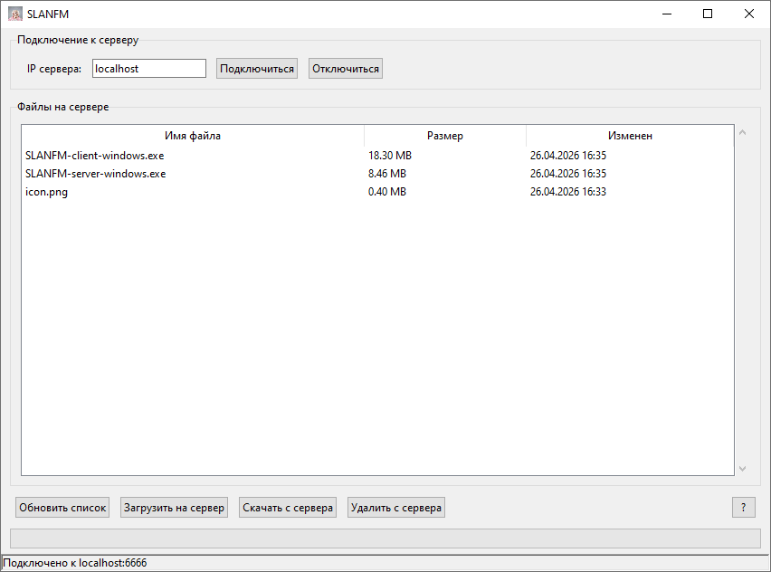
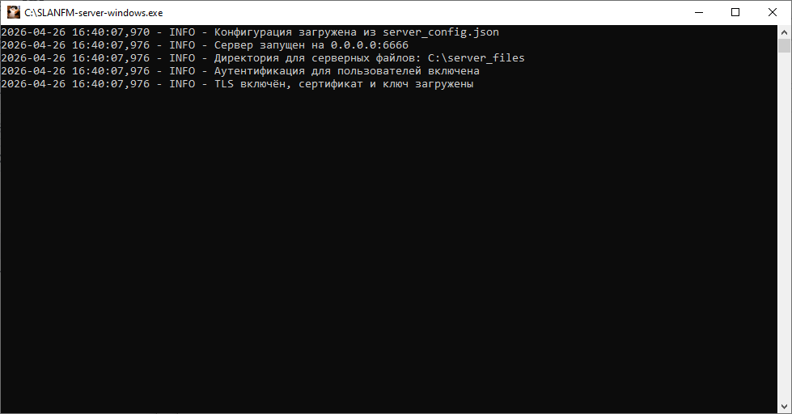

# SLANFM

**Простое клиент-серверное приложение для передачи файлов.**

## Установка и запуск

1. Перейдите на [страницу релизов](https://github.com/Sandile225325/SLANFM/releases) и скачайте последние версии архивов:
   - `SLANFM-client-windows.zip` – клиент;
   - `SLANFM-server-windows.zip` – сервер.

2. Распакуйте каждый архив.

3. Запустите `SLANFM-server-windows.exe` для хостинга сервера.

4. Запустите `SLANFM-client-windows.exe` для использования клиента.

**ИЛИ**

1. Клонируйте репозиторий и перейдите в его корневую папку:

   ```
   git clone -b next https://github.com/Sandile225325/SLANFM.git
   cd SLANFM
   ```

2. Установите необходимые библиотеки:

   ```
   pip install -r requirements.txt
   ```

3. Запуск сервера:

   ```
   python server/server.py
   ```

4. Запуск клиента:
   ```
   python client/gui.py
   ```

## Настройка

### Сервер

Конфигурация сервера хранится в файле **`server/server_config.json`**.

| Параметр                   | Тип     | Описание                                                                                      |
| -------------------------- | ------- | --------------------------------------------------------------------------------------------- |
| `host`                     | string  | IP-адрес для прослушивания (`0.0.0.0` — все интерфейсы)                                       |
| `port`                     | number  | Порт, на котором работает сервер                                                              |
| `upload_dir`               | string  | Путь для хранения файлов (может быть относительный или абсолютный)                            |
| `max_file_size`            | number  | Максимальный размер загружаемого файла в байтах                                               |
| `chunk_size`               | number  | Размер блока данных при передаче в байтах                                                     |
| `timeout`                  | number  | Таймаут сокета в секундах                                                                     |
| `can_clients_delete_files` | boolean | Разрешать ли клиентам удаление файлов                                                         |
| `auth_token`               | string  | Токен для аутентификации клиентов. Если пустое — аутентификация не требуется                  |
| `tls_enabled`              | boolean | Использовать ли шифрование TLS. Если `false`, параметры `cert_file` и `key_file` игнорируются |
| `cert_file`                | string  | Путь к файлу сертификата (необходим для работы TLS)                                           |
| `key_file`                 | string  | Путь к файлу приватного ключа (необходим для работы TLS)                                      |

### Клиент

Конфигурация клиента хранится в файле **`client/config.json`**.

| Параметр                         | Тип    | Описание                                                                                                                  |
| -------------------------------- | ------ | ------------------------------------------------------------------------------------------------------------------------- |
| `connect_config.PORT`            | string | Порт, используемый при подключении                                                                                        |
| `connect_config.non-tls_timeout` | number | Таймаут подключения в секундах при работе без TLS                                                                         |
| `connect_config.tls_timeout`     | number | Таймаут подключения в секундах при работе с TLS                                                                           |
| `values_config.chunk_size_range` | array  | Допустимый диапазон размера чанка в байтах. Если сервер предлагает значения вне диапазона — клиент откажется подключаться |
| `values_config.timeout_range`    | array  | Допустимый диапазон таймаута в секундах. Если сервер предлагает значения вне диапазона — клиент откажется подключаться    |
| `input_save_config.host`         | string | Последний введённый IP-адрес                                                                                              |
| `authentication_config.token`    | string | Токен для аутентификации при подключении. Можно оставить пустым для ручного ввода при подключении                         |
| `paths_config.downloads_dir`     | string | Путь для сохранения скачанных файлов (может быть относительный или абсолютный)                                            |

### Генерация самоподписанного сертификата для TLS

Для включения шифрования можно сгенерировать собственный сертификат и ключ с помощью OpenSSL:

```
openssl req -x509 -newkey rsa:4096 -keyout private_key.key -out certificate.crt -days 3650 -nodes -subj "/CN=SLANFM"
```

После выполнения появятся файлы **`private_key.key`** и **`certificate.crt`**.

## Использование

### Сервер

Сервер работает в консольном режиме. При запуске выводится информация о хосте, порте, папке для серверных файлов, аутентификации, TLS.  
В процессе работы логируются действия клиентов (загрузки, скачивания, удаления).

### Клиент

`Подключиться` — подключиться к указанному серверу;  
`Отключиться` — закрыть соединение;  
`Обновить список` — обновить список файлов на сервере;  
`Загрузить на сервер` — выбрать локальный файл и отправить его на сервер;  
`Скачать с сервера` — выбрать файл в списке и сохранить его;  
`Удалить с сервера` — удалить выбранный файл (если разрешено на сервере);  
`?` — отображает информацию о версии, подключении, параметрах сервера или допустимых диапазонах.

## Скриншоты




## Лицензия

[Apache-2.0 license](https://github.com/Sandile225325/SLANFM/blob/next/LICENSE)